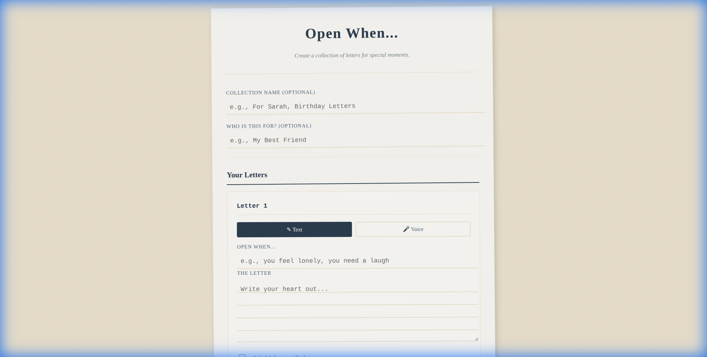
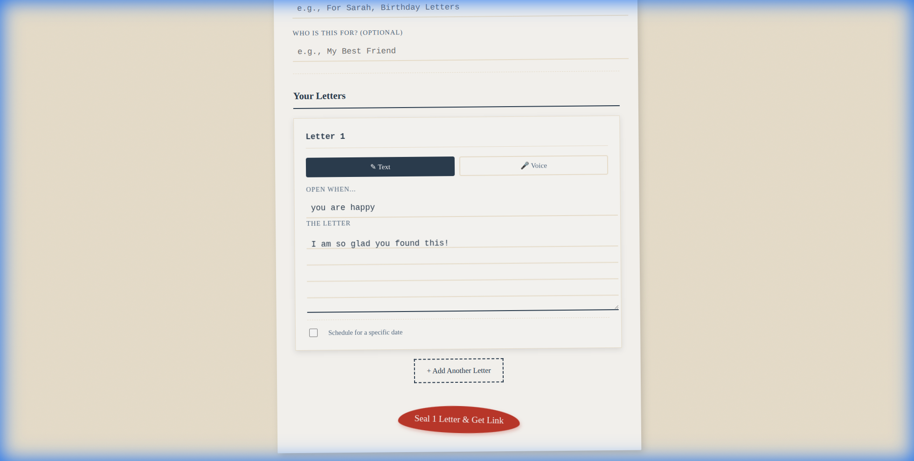
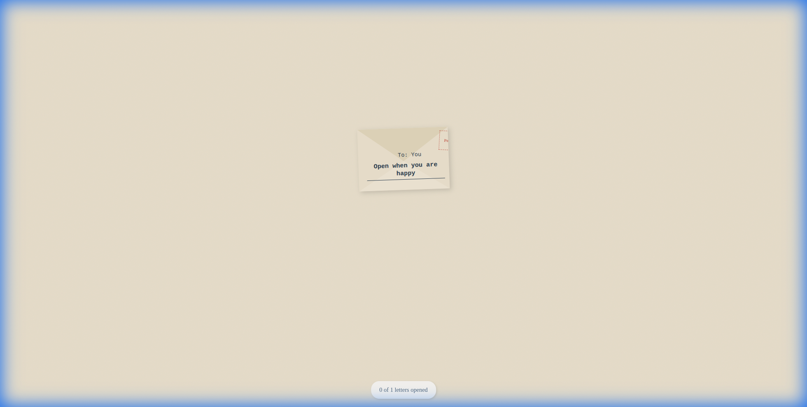
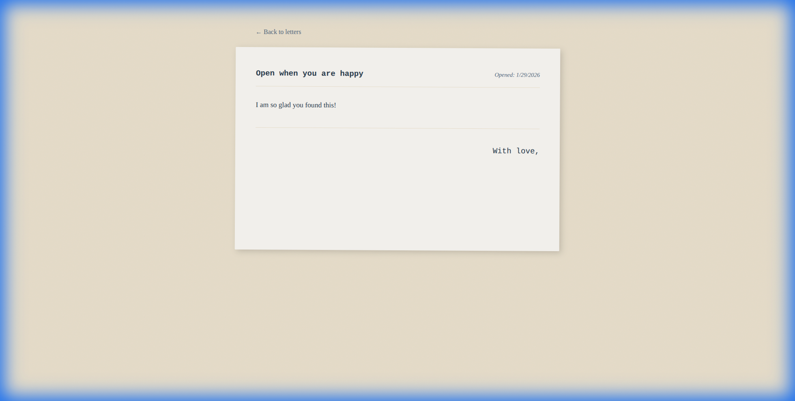

# Open When... 💌

> A digital reimagining of the classic "Open When" letters, designed to feel analog, personal, and timeless.

**Open When** is a web application that allows you to create thoughtful collections of digital letters for your loved ones. Whether it's for a long-distance partner, a best friend, or a future self, these letters are sealed in digital envelopes and can be scheduled to open only when the time is right.



## ✨ Features

*   **✉️ Digital Envelopes**: A tactile, skeuomorphic interface where letters feel like real objects scattered on a desk.
*   **🎤 Voice Notes**: Don't just write; speak. Record meaningful voice messages directly in the browser.
*   **⏳ Time Capsules**: Schedule letters to unlock on specific future dates (e.g., "Open on your birthday").
*   **☁️ Cloud Sharing**: Large collections (especially with voice) are automatically uploaded to the cloud for a short, shareable one-line link.
*   **🔒 Secure & Private**: Letters are encoded or stored securely with unique IDs.
*   **📱 Mobile Friendly**: A responsive design that works perfectly on phones for on-the-go comfort.

## 🛠️ Tech Stack

*   **Frontend**: React 19, Vite
*   **Routing**: React Router v7
*   **Styling**: Pure CSS (Glassmorphism + Paper Textures)
*   **Compression**: LZ-String (for text-based URL sharing)
*   **Storage**: Bytebin (for cloud persistence of large media)
*   **Audio**: MediaRecorder API

## 🚀 Getting Started

### Prerequisites

*   Node.js (v18 or higher)
*   npm

### Installation

1.  Clone the repository:
    ```bash
    git clone https://github.com/blendshalaa/open-when.git
    cd open-when
    ```

2.  Install dependencies:
    ```bash
    npm install
    ```

3.  Run the development server:
    ```bash
    npm run dev
    ```

4.  Open `http://localhost:5173` in your browser.

## 📸 Screenshots

### Writing a Letter
Choose between text or voice, label your letter, and seal it.


### The Recipient Experience
Recipients see a collection of sealed envelopes. They can only open what is unlocked.


### Opening a Letter
Experience the joy of opening a letter with a heartfelt message or voice note.


## 🤝 Contributing

This is a personal portfolio project. Feel free to fork and make it your own!

## 📄 License

MIT
